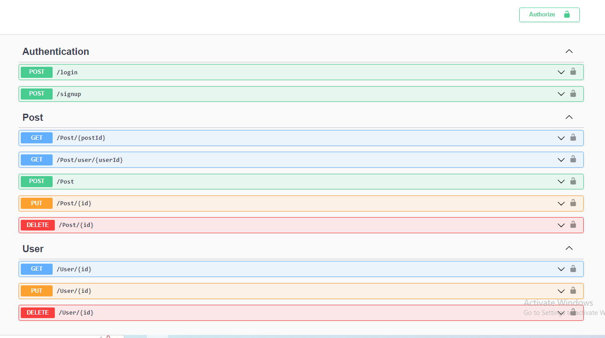
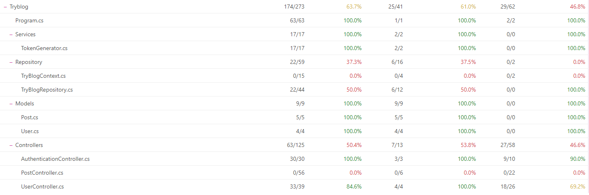

# TryBlog Backend - Aceleração de C#

Esse projeto consiste em uma API REST que retornaria informações para o front-end. A aplicação seria um fórum para estudantes, que permite os usuários
criar postagens novas, alterar postagens antigas, buscar postagens, etc. 

  
<strong>Tecnologias utilizadas:</strong>

  Foi utilizado <strong>SQL Server</strong> para gerenciar o banco de dados e <strong>ASP.NET Core 6</strong> para criar a aplicação Web, 
  o ORM <strong>Entity Framework</strong> para realizar a conexão do banco de dados com a API, <strong>XUnit</strong> e <strong>FluentAssertions</strong>
  para realizar os testes.

  
<strong>Como rodar a aplicação:</strong>

 Como a aplicação utiliza um banco de dados local será necessário rodar um container Docker com uma imagem SQL Server para conseguir realizar as requisições.
  
  <ul>
    <li>Primeiro rode <code>docker-compose up -d</code> para subir o container com o Banco de Dados</li>
    <li>A senha para a conexão com o DB  é <code>Senha123$</code>, o server é <code>127.0.0.1</code> e o username é <code>SA</code></li> 
    <li>Após conectar ao SQL Server, rode a query <code>TryBlog_Query.sql</code> na sua ferramenta de banco de dados</li>
    <li>Vá para a pasta TryBlog e rode o comando <code>dotnet restore</code>, seguido de <code>dotnet run</code></li>
  </ul>

<h2>🛣Rotas🛣</h2>

  
  <ul>
   <li>As rotas <code>login</code> e <code>signup</code> fazem login e cadastro de usuários novos. Quando a requisição é bem sucedida retorna 
     um <strong>token</strong></li>
   </ul>
   <h3>🚨Para acessar as próximas rotas é necessário inserir clicar em Authorize e inserir <code>Bearer {token-gerado}</code>🚨</h3>
  <ul>
   <li>As rotas <code>PUT post/id</code>, <code>POST post/id</code>, e <code>DELETE post/id</code> permitem alterar apenas posts feitos pelo usuário logado</li>
   <li>As rotas <code>PUT user/id</code> e <code>DELETE user/id</code> permitem alterar apenas alterar dados do usuário logado também</li>
  </ul>

<h2>🧐Testes🧐</h2>

   
   <h4>Foi utilizado um banco de dados inMemory para realizar os teste de integração</h4>

<h2>🤔Implementações futuras🤔</h2>

   <ul>
     <li>Maior cobertura de testes</li>
     <li>Deploy da aplicação</li>
     <li>Validação de Email</li>
  </ul>

